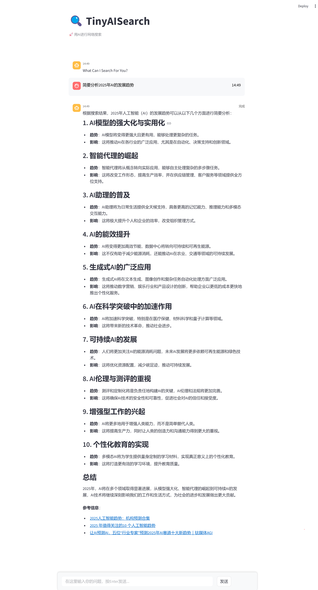
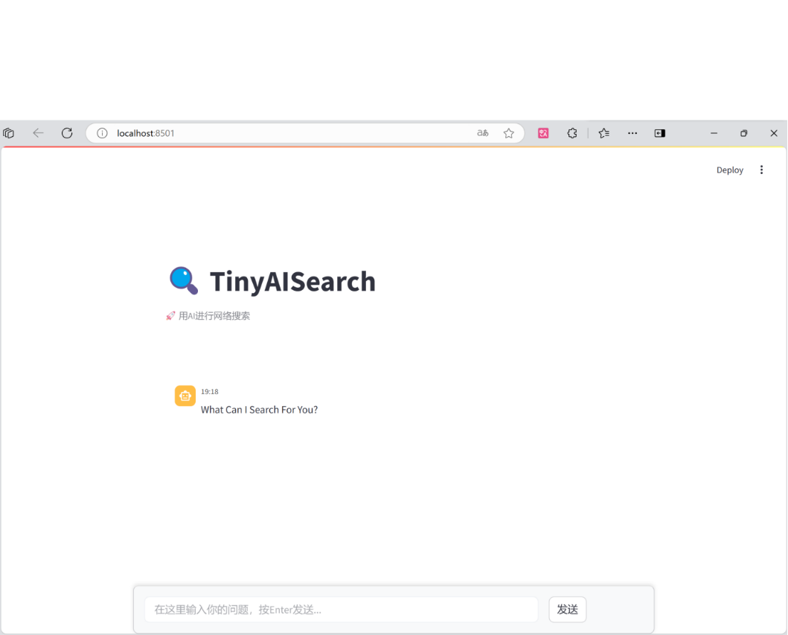
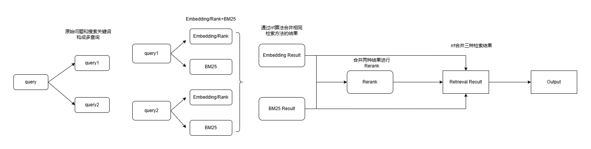

#  🔍TinyAISearch 

TinyAISearch实现了搜索关键词重写、网页爬取、网页内容召回、前端流式显示回答一系列的AI搜索流程。其中RAG部分使用了相似度召回+重排序、重排序+BM25、多问题召回等多种策略，你可以自行选择，帮助你了解不同的召回策略的优劣。该项目支持不同厂商的大模型（Qwen，GLM，DeepSeek，OpenAI...），你也可以使用本地Ollama大模型。项目代码有详细注解，如果你对项目感兴趣，这将对你修改代码逻辑提供了极大的便利，也欢迎你将它修改为你喜欢的样子，并从中学到知识，希望你能玩的开心😘

对话示例：



 
---
### 📖上手指南

以下指南将帮助你在本地机器上安装和运行该项目，进行本地对话。

###### 🔧开发前的配置要求

1. 安装Anaconda或者Miniconda
2. 虚拟环境Python=3.10

###### 🛠️安装步骤

1. 克隆仓库

```sh
git clone https://github.com/David-Lolly/TinyAISearch.git
cd TinyAISearch
```

2. 安装依赖
```sh
conda create -n TinyAISearch python=3.10
conda activate TinyAISearch 
pip install -r requirements.txt -i https://mirrors.aliyun.com/pypi/simple/ --trusted-host=mirrors.aliyun.com
# 使用pip安装faiss存在一点问题，这里使用conda来安装
conda install faiss 
# 完成crawl4ai包的后续初始化步骤
crawl4ai-setup 
# 验证是否安装成功
crawl4ai-doctor 
```

---


### 🚀快速上手
1. 📝填写配置文件config.json，支持所有OpenAI接口的大模型(Qwen、GLM、DeepSeek....），我使用的Embedding和Rerank模型是[硅基流动](https://cloud.siliconflow.cn/account/ak) 的模型（free🤩），示例：

  下面以DeepSeek的大模型为例，你只需要将在[DeepSeek](https://platform.deepseek.com/api_keys)申请到的api key填到对应位置，将在[硅基流动](https://cloud.siliconflow.cn/account/ak)申请到的api key填写到cloud_embedding和cloud_rerank对应位置即可。
```json
{  
  "local_embedding_model": false,  
  "local_rerank_model": false,  
  "LLM": {
    "model_name": "deepseek-chat",  
    "base_url": "https://api.deepseek.com/v1",  
    "api_key": "sk-xxxxx",  
    "description":"model_name填写大模型名称，base_url填写该模型厂商的base_url,api_key填写你创建的api key"
  },  
  "embedding_model": {  
    "local_embedding": {  
      "model_path": "D:\\model\\huggingface_model\\BAAI\\bge_large_zh",  
      "description":"默认使用云端embedding模型，路径可以不填，若local_embedding_model为true，表示使用本地embedding模型。model_path填写本地embedding模型路径"  
    },  
    "cloud_embedding": {  
      "model_name": "BAAI/bge-large-zh-v1.5",  
      "base_url": "https://api.siliconflow.cn/v1/embeddings",  
      "api_key": "sk-xxxxxx",  
      "description":"model_name填写embedding模型名称，base_url填写该模型厂商的base_url,api_key填写你创建的api key"  
    }  
  },  
  "rerank_model": {  
    "local_rerank": {  
      "model_path": "D:\\model\\huggingface_model\\Rerank",  
      "description":"默认使用云端rerank模型，路径可以不填，若local_rerank_model为true，表示使用本地rerank模型。model_path填写本地rerank模型路径"  
    },  
    "cloud_rerank": {  
      "model_name": "BAAI/bge-reranker-v2-m3",  
      "base_url": "https://api.siliconflow.cn/v1/rerank",  
      "api_key": "sk-xxxxxx",  
      "description":"model_name填写rerank模型名称，base_url填写该模型厂商的base_url,api_key填写你创建的api key"  
    }  
  },  
  "retrieval": {  
    "quality": "high",  
    "method": {  
      "similarity": {  
        "activate": true,  
        "top_k": 10,  
        "description": "使用similarity+rerank的方法进行召回，activate的值为true表示使用该方法，top_k控制召回文本数量"  
      },  
      "rank": {  
        "activate": false,  
        "top_k": 10,  
        "description": "使用rank+BM25的方法进行召回，activate的值为true表示使用该方法，只能选择一种召回方法，top_k控制召回文本数量"  
      }  
    },  
    "description":"quality表示召回的质量，可以在high、higher之间选。high召回质量一般，速度更快；higher召回质量更高，速度稍慢。两种召回方法分别是相似度召回(similarity)和重排序召回(rank),通过activate的值来选择使用哪种方法。top_k控制召回文本数量"  
  },  
  "search_engine": {  
    "name": "baidu",  
    "api_key": "",  
    "cse": "",  
    "description": "name可以在baidu、google和serper三者之间选择。baidu使用python库，不需要管api_key和cse，可以直接使用；google需要填写对应的api_key和cse；serper只需要填写对应的api_key，不用管cse。google和serper的搜索结果优于baidu"  
  },  
  "debug": {  
    "value": true,  
    "description": "debug是用来调试代码，当你遇到代码报错或者想要修改代码时建议将value设置为true，然后运行search.py，这样你就可以在IDE中对代码进行调试，当你调试好代码想到前端看效果时，将value设置为false"  
  }  
}
```
**说明**:
- debug是用来**测试**的时候使用，如果你想到前端查看效果记得将其设置为false
- 召回质量可以选择high或higher,high召回兼顾精度和速度，**similarity**召回为similarity+rerank，**rank**召回为rank+BM25双路召回;在higher召回更偏向于精度，**similarity**召回为双query召回（用户query和搜索关键词），使用similarity+BM25，**rank**召回为双query召回（同上），使用rank+BM25。
- **local_embedding_model**和**local_rerank_model**用于控制是否使用本地的embedding模型和本地rerank模型，默认不使用本地模型（使用本地模型可能更快一点）
- 搜索引擎推荐使用google，搜索结果较好（100 free uses per day😋）
- 其他的说明请阅读config文件中的description


1. 💡配置文件写好之后，测试能否正常运行
```sh
python AISearch.py
```


  3. 🔥测试没有问题后将配置文件中的debug设置为false，继续运行下面命令
```sh
python AISearch_api.py
# 在新的命令窗口输入以下命令
streamlit run app.py
```


4. ✅一切顺利的话你将看到以下界面



恭喜你成功运行了该项目🎉🎉🎉

---
### 📐结构说明

higher召回说明：

[//]: # (![多问题召回]&#40;./images/multi_query_retrieval.png&#41;)


文件结构:

```
│  app.py  # 前端对话页面
│  LICENSE.txt
│  README.md
│  requirements.txt
│  search.py # 本地调试代码，测试代码是否能正常运行
│  search_api.py # AI搜索接口，为前端提供服务
│
├─config
│      config.json # 配置文件   
│
├─images
│      img.png
│      multi_query_retrieval.png
│      success.png
│
└─utils
        crawl_web.py # 爬取网页
        keywords_extract.py # 根据用户输入的query提取搜索关键词
        response.py # 模型回复
        retrieval.py # 不同的检索策略
        rrf.py # 通过rrf算法综合不同召回结果
        search_web.py # 通过搜索引擎搜索相关内容
        __init__.py

```

---


### 🧐如何二次开发
对于喜欢钻研的朋友，你可以在项目的基础上进行二次开发，修改提示词、修改召回方法、使用更智能的大模型等等，大家自行发挥。

- 你可以在search_web.py自定义搜索引擎。
- 你可以在rrf.py中使用自定义的召回方法，比较不同召回方法的优劣。
- .......


---
### 版权说明

该项目签署了MIT 授权许可，详情请参阅 [LICENSE](./LICENSE.txt)


