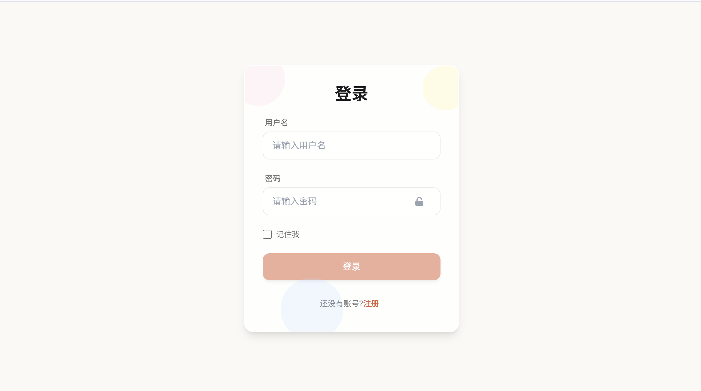

# TinyAISearch
[ 简体中文 | [English](README_EN.md) ]


---

**TinyAISearch** 是一个轻量级的 AI 搜索项目，它实现了从 **搜索关键词分析**、**网页爬取**、**内容召回** 到 **流式回答** 的完整 RAG 流程。

项目集成了多种召回策略（如相似度、BM25、多路召回等），支持灵活配置，让你能深入探索不同策略的优劣。同时，它兼容所有兼容 OpenAI API 的大模型（Qwen、DeepSeek、GLM、Ollama 等）。

前端基于 **Vue 3** 开发，界面简洁现代，支持表格，公式，代码支持多用户、多会话等功能。希望能为你带来愉快的体验！

## 运行效果

### 主要功能界面

**1. 登录界面**



**2. 应用主界面**


### 核心功能演示

**日常对话功能**


**页面渲染**
- 代码块


- 数学公式


**联网搜索功能**


**回答引用溯源**


## 功能特性

- **智能搜索规划**：分析用户查询，动态生成搜索计划。
- **多种召回策略**：内置 **V1（传统 RAG）** 和 **V2（网页级召回）** 两种模式，支持相似度、BM25、RRF 多路召回与重排序。
- **高度可扩展**：支持任意兼容 OpenAI API 的 **LLM**。
- **现代化前端**：基于 **Vue 3 + Vite** 构建，界面美观，支持多用户和多会话管理。
- **开箱即用**：提供详尽的部署指南，让你在几分钟内就能启动并运行项目。

## 部署指南

### 环境要求

根据您选择的部署方式，请确保您的环境满足以下要求：

#### Docker 部署（推荐）
- **Docker**: 20.10.0 或更高版本
- **Docker Compose**: v2.0 或更高版本

#### 源码部署
- **Node.js**: v18.0 或更高版本
- **Python**: v3.10
- **Conda**: 用于管理 Python 虚拟环境

### 下载项目

首先克隆项目仓库到本地：

```bash
git clone https://github.com/David-Lolly/TinyAISearch.git
cd TinyAISearch
```

### 方式一：Docker 部署（推荐）

Docker 部署是最简单快速的方式，无需手动配置环境依赖。

#### 1. 启动服务

```bash
# 在项目根目录下执行
docker-compose up -d
```

#### 2. 验证部署

```bash
# 查看容器运行状态
docker-compose ps
```

#### 3. 访问应用

等待容器构建完成后，在浏览器中访问：
- **前端界面**：http://localhost:8080

#### 4. 停止服务

```bash
# 停止并删除容器
docker-compose down

```

### 方式二：源码部署

源码部署适合需要进行二次开发或深度定制的用户。

#### 1. 后端环境配置

```bash
# 创建并激活 Conda 虚拟环境
conda create -n TinyAISearch python=3.10
conda activate TinyAISearch

# 安装 Python 依赖 (建议使用国内镜像源加速)
pip install -r requirements.txt -i https://pypi.tuna.tsinghua.edu.cn/simple
```

#### 2. 前端环境配置

```bash
# 进入前端目录
cd frontend

# 配置 npm 镜像源（可选，用于加速依赖下载）
npm config set registry https://registry.npmmirror.com

# 安装前端依赖
npm install
```

#### 3. 启动服务

需要同时启动前端和后端服务，建议打开两个终端窗口：

**终端1：启动后端服务**
```bash
# 在项目根目录 TinyAISearch/ 下
conda activate TinyAISearch
python AISearchServer.py
```
> 看到 `Uvicorn running on http://localhost:5000` 表示后端启动成功

**终端2：启动前端服务**
```bash
# 在 frontend/ 目录下
npm run dev
```
> 前端服务通常运行在 `http://localhost:5173`，请关注终端输出的实际地址

#### 4. 访问应用

前后端都启动成功后，在浏览器中访问前端地址即可开始使用。

### 首次使用配置

无论采用哪种部署方式，首次使用都需要完成以下配置步骤：

#### 1. 用户注册

访问应用后，首先需要注册一个账号。用户名和密码可以任意设置，系统会自动创建本地账户。

#### 2. 模型配置

登录成功后会自动跳转到配置页面，需要填写以下必要信息：

**检索模式选择**：
- **V2 (推荐)**：创新的网页级召回模式，更适合联网搜索场景
- **V1**：传统的 RAG 模式，基于文本块（Chunk）进行召回

**V1 召回质量**（仅在选择V1模式时需要配置）：
- `high`：相似度检索 + Rerank 重排序
- `higher`：多路召回（相似度 + BM25）+ RRF 融合

**模型配置**：
- **LLM 模型**：填写 API Key 和 Base URL
- **Embedding 模型**：填写 API Key 和 Base URL  
- **Rerank 模型**（V2模式无需配置）：填写 API Key 和 Base URL

**推荐服务提供商**：
- [硅基流动](https://cloud.siliconflow.cn/account/ak)：提供免费的模型服务额度
- 其他兼容 OpenAI API 的服务商

**搜索引擎配置**：
- **主要搜索**：默认使用 DuckDuckGo（无需配置）
- **备用搜索**（可选）：Google 可编程搜索 API（每天免费100次调用）

#### 3. 连接测试

配置完成后，点击每个配置项右侧的"连接测试"按钮，确保所有必填项的连接测试都通过后，才能保存配置并开始使用。

#### 4. 开始使用

配置保存成功后，即可开始您的 AI 搜索体验！

### 常见问题

**Q: Docker 部署时容器启动失败怎么办？**
A: 请检查端口占用情况，确保 8080 和 5000 端口未被其他程序占用。可以使用 `docker-compose logs` 查看详细错误信息。

**Q: 源码部署时依赖安装失败怎么办？**
A: 建议使用国内镜像源，如遇到网络问题可以尝试使用 VPN 或更换镜像源。

**Q: 配置完成后连接测试失败怎么办？**
A: 请检查 API Key 是否正确，Base URL 是否可访问，网络连接是否正常。
B: Google 连接失败，API Key和CSE是否填写正确，查看是否开启代理

## 技术实现

### API文档：
请在doc目录下查看对应的API文档，了解后端各个版块的具体功能以及参数传递

<details>
<summary><strong>V1 检索模式 (点击展开)</strong></summary>

-   **High 质量**: 对用户问题进行 Embedding，在向量数据库中进行相似度检索，并对召回的文本块进行 Rerank 重排序。
-   **Higher 质量**:
    1.  **多路查询生成**: 基于用户原始问题，由 LLM 生成多个衍生问题。
    2.  **多路召回**: 同时使用 **相似度检索** 和 **BM25 稀疏检索** 对所有问题进行召回。
    3.  **RRF 融合**: 使用 **倒数排序融合 (Reciprocal Rank Fusion)** 算法合并多路召回结果，提升查准率。
    <br>
    
</details>

<details>
<summary><strong>V2 检索模式 (点击展开)</strong></summary>

V2 模式模拟了人类的搜索行为，以网页为单位进行召回，旨在为 LLM 提供更完整、更连贯的上下文信息。

**工作流程示例**:
1.  **用户输入**: `今天武汉天气`
2.  **搜索规划**: LLM 分析查询，生成一个包含多个子查询的搜索计划。

    ```json
    {
      "query_analysis": {
        "original_query": "今天武汉天气如何？",
        "key_entities": ["今天武汉天气"]
      },
      "search_plan": {
        "foundational_queries": [
          {"query": "今天武汉天气预报", "engine": "baidu"}
        ]
      }
    }
    ```
3.  **网页爬取**: 根据搜索计划，使用指定的搜索引擎获取多个网页链接，并爬取其正文内容。
4.  **网页级召回**:
    -   **向量相似度**: 计算查询与每个网页全文的向量相似度。
    -   **BM25 相似度**: 计算查询与每个网页全文的 BM25 分数。
    -   **加权排序**: 将两种分数加权求和，得到最终排序。
5.  **内容生成**: 将排名最高的若干个 **完整网页内容** 作为上下文，提交给 LLM 生成最终回答。

**设计理念**:
对于人类来说，每次搜索大概率不会把搜索到的网页挨个全部看一遍，因为搜索到的网页都是关于该问题的，只需要看两三个网页就足以解决问题，而且我们在详细阅读之前会粗略的浏览一下网页，看一下和我们问题的相关程度以及内容的质量，质量高的才会阅读，质量不好的大概率不会浪费时间阅读。对于V1检索模式(传统RAG)，对同一个query搜索得到的网页内容差别不是很大，召回的零散知识片段之间的描述可能大差不差，甚至有些重复，而且不利于模型比较系统的了解背景知识。召回整个网页内容的方式，这样可以提供详细具体的背景知识和解决方案，有利于模型理解用户的核心问题所在
</details>


## 文件结构

```text
TinyAISearch/
├─ AISearchServer.py             #  FastAPI 后端主入口
├─ requirements.txt              #  Python 依赖列表
│
├─ frontend/                     #  前端子项目 (Vue 3 + Vite)
│  ├─ package.json               #  前端依赖与 npm 脚本
│  └─ src/                       #  前端业务源码
│     ├─ components/             #  可复用 UI 组件
│     ├─ services/               #  API 服务封装
│     └─ views/                  #  页面级组件
│
├─ images/                       #  README 配图
├─ logs/                         #  运行日志目录
│
└─ utils/                        #  后端核心功能模块
   ├─ config_manager.py          #  配置管理模块
   ├─ crawl_web.py               #  网页爬虫
   ├─ database.py                #  数据库交互
   ├─ keywords_extract.py        #  关键词与搜索计划提取
   ├─ pages_retrieve.py          #  V2 网页级召回
   ├─ response.py                #  LLM 回答生成
   ├─ retrieval.py               #  V1 传统 RAG 召回
   └─ search_web.py              #  搜索引擎封装
```

## TODO List
- 文件上传与解析
- 支持图片上传
- 优化记忆机制
- 增加对推理模型思考过程的展示（目前使用推理模型，思考过程不会显示，只显示回答内容，若使用推理模型太久没有响应属于正常情况）

## 社区贡献

我们非常欢迎来自社区的贡献！如果你有任何建议或问题，请随时：

-   提交 **[Issue](https://github.com/David-Lolly/TinyAISearch/issues)**
-   创建 **[Pull Request](https://github.com/David-Lolly/TinyAISearch/pulls)**


