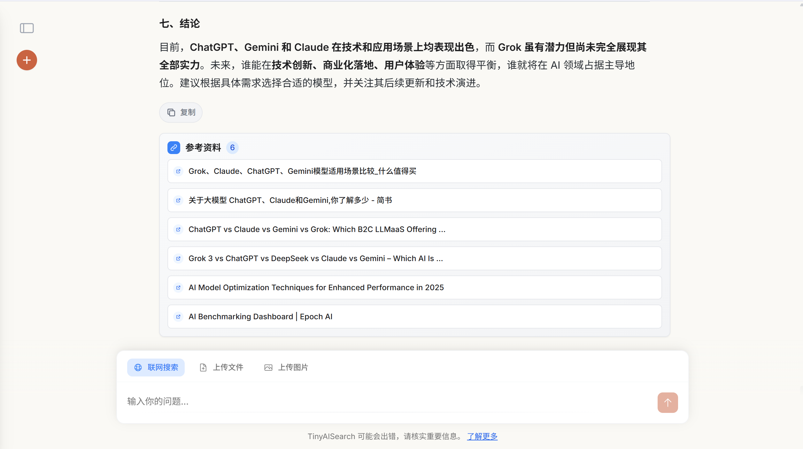

# 🔍 TinyAISearch ✨
[ 简体中文 | [English](README_EN.md) ]


---

**TinyAISearch** 是一个轻量级的 AI 搜索项目，它实现了从 **搜索关键词分析**、**网页爬取**、**内容召回** 到 **流式回答** 的完整 RAG 流程。

项目集成了多种召回策略（如相似度、BM25、多路召回等），支持灵活配置，让你能深入探索不同策略的优劣。同时，它兼容所有兼容 OpenAI API 的大模型（Qwen、DeepSeek、GLM、Ollama 等）。

前端基于 **Vue 3** 开发，界面简洁现代，支持多用户、多会话等功能。希望能为你带来愉快的体验！😘

## 🖼️ 运行效果

| 聊天主界面 | 创建新会话 | 回答引用溯源 |
| :---: | :---: | :---: |
|  |  |  |

## ✨ 功能特性

- **🧠 智能搜索规划**：分析用户查询，动态生成搜索计划。
- **🔧 多种召回策略**：内置 **V1（传统 RAG）** 和 **V2（网页级召回）** 两种模式，支持相似度、BM25、RRF 多路召回与重排序。
- **🔌 高度可扩展**：支持任意兼容 OpenAI API 的 **LLM**。
- **💻 现代化前端**：基于 **Vue 3 + Vite** 构建，界面美观，支持多用户和多会话管理。
- **🚀 开箱即用**：提供详尽的部署指南，让你在几分钟内就能启动并运行项目。

## 📖 上手指南

### 1. 环境准备

在开始之前，请根据部署方式确保你的本地环境中安装了对应软件：
**1、源码部署**：

- **Node.js**: `v18.0` 或更高版本。
- **Python**: `v3.10`。
- **Conda**: 用于管理 Python 虚拟环境。

*2、docker部署**：
- **Docker**
- **Docker Compose**

### 2. 下载与安装

#### 克隆项目仓库

```sh
git clone https://github.com/David-Lolly/TinyAISearch.git
cd TinyAISearch
```
#### Docker部署
```sh
docker-compose up -d
# 等待容器构建后即可，启动成功后访问本机8080端口
```

#### 源码部署

#### 1、配置后端

```sh
# 创建并激活 Conda 虚拟环境
conda create -n TinyAISearch python=3.10
conda activate TinyAISearch

# 安装依赖 (建议使用国内镜像源加速)
pip install -r requirements.txt -i https://pypi.tuna.tsinghua.edu.cn/simple

# Faiss 依赖建议使用 Conda 安装，以避免兼容性问题
# 如果你有 GPU，可以安装 GPU 版本：conda install -c pytorch faiss-gpu
conda install -c pytorch faiss-cpu
```

#### 2、配置前端

```sh
# 进入前端目录
cd frontend

# 安装 npm 依赖 (建议使用国内镜像源加速)，整个过程需要点时间，可以休息等待一会
npm config set registry https://registry.npmmirror.com
npm install
```

### 3. 启动项目

请打开 **两个** 终端窗口，分别执行以下命令：

- **终端 1：启动后端服务** (在项目根目录 `TinyAISearch/` 下)

```sh
conda activate TinyAISearch
python AISearchServer.py
```
> 看到 `Uvicorn running on http://localhost:5000` 表示后端启动成功。

- **终端 2：启动前端服务** (在 `TinyAISearch/frontend/` 目录下)

```sh
npm run dev
```
> 前端通常会运行在 `http://localhost:5173`，请留意终端输出的实际地址，成功后即可打开浏览器访问。

### 4. 快速上手

1.  **注册与登录**：前后端都成功启动后，在浏览器中访问前端地址。首次使用需要注册一个账号，用户名和密码可任意填写。

    

2.  **配置模型**：登录后，将进入 **配置页面** 填写必要的 API Key 和 Base URL,后续想要更改配置，可以在侧边栏点击个人信息，在弹出的“修改配置”中进行修改。

    

    **配置说明**:
    -   **检索模式**:
        -   **V2 (推荐)**: 创新的网页级召回模式，更适合联网搜索场景。
        -   **V1**: 传统的 RAG 模式，基于文本块（Chunk）进行召回。
    -   **V1 召回质量**:
        -   `high`: 相似度检索 + Rerank 重排序。
        -   `higher`: 多路召回（相似度 + BM25）+ RRF 融合。
    -   **模型配置**:
        -   请填写 **LLM**、**Embedding** 及 **Rerank** 模型的 `API_KEY` 和 `BASE_URL`。
        -   **V2 模式无需 Rerank 模型**。
        -   你可以从 [硅基流动](https://cloud.siliconflow.cn/account/ak) 等平台获取免费的模型服务。
    -   **辅助搜索引擎**:
        -   建议配置 Google Search API，作为 DuckDuckGo 被临时封禁时的备用方案，Google可编程搜索每天有100次免费调用。
    -   **保存配置**:
        -   所有必填项右侧的 **连接测试必须全部通过** 后，才能保存配置并开始聊天。

3.  **开始聊天**：配置完成后，即可开始你的 AI 搜索之旅！🎉

## 🔧 技术实现

### API文档：
请在doc目录下查看对应的API文档，了解后端各个版块的具体功能以及参数传递

<details>
<summary><strong>V1 检索模式 (点击展开)</strong></summary>

-   **High 质量**: 对用户问题进行 Embedding，在向量数据库中进行相似度检索，并对召回的文本块进行 Rerank 重排序。
-   **Higher 质量**:
    1.  **多路查询生成**: 基于用户原始问题，由 LLM 生成多个衍生问题。
    2.  **多路召回**: 同时使用 **相似度检索** 和 **BM25 稀疏检索** 对所有问题进行召回。
    3.  **RRF 融合**: 使用 **倒数排序融合 (Reciprocal Rank Fusion)** 算法合并多路召回结果，提升查准率。
    <br>
    
</details>

<details>
<summary><strong>V2 检索模式 (点击展开)</strong></summary>

V2 模式模拟了人类的搜索行为，以网页为单位进行召回，旨在为 LLM 提供更完整、更连贯的上下文信息。

**工作流程示例**:
1.  **用户输入**: `今天武汉天气`
2.  **搜索规划**: LLM 分析查询，生成一个包含多个子查询的搜索计划。

    ```json
    {
      "query_analysis": {
        "original_query": "今天武汉天气如何？",
        "key_entities": ["今天武汉天气"]
      },
      "search_plan": {
        "foundational_queries": [
          {"query": "今天武汉天气预报", "engine": "baidu"}
        ]
      }
    }
    ```
3.  **网页爬取**: 根据搜索计划，使用指定的搜索引擎获取多个网页链接，并爬取其正文内容。
4.  **网页级召回**:
    -   **向量相似度**: 计算查询与每个网页全文的向量相似度。
    -   **BM25 相似度**: 计算查询与每个网页全文的 BM25 分数。
    -   **加权排序**: 将两种分数加权求和，得到最终排序。
5.  **内容生成**: 将排名最高的若干个 **完整网页内容** 作为上下文，提交给 LLM 生成最终回答。

**设计理念**:
对于人类来说，每次搜索大概率不会把搜索到的网页挨个全部看一遍，因为搜索到的网页都是关于该问题的，只需要看两三个网页就足以解决问题，而且我们在详细阅读之前会粗略的浏览一下网页，看一下和我们问题的相关程度以及内容的质量，质量高的才会阅读，质量不好的大概率不会浪费时间阅读。对于V1检索模式(传统RAG)，对同一个query搜索得到的网页内容差别不是很大，召回的零散知识片段之间的描述可能大差不差，甚至有些重复，而且不利于模型比较系统的了解背景知识。召回整个网页内容的方式，这样可以提供详细具体的背景知识和解决方案，有利于模型理解用户的核心问题所在
</details>


## 📂 文件结构

```text
TinyAISearch/
├─ AISearchServer.py             #  FastAPI 后端主入口
├─ requirements.txt              #  Python 依赖列表
│
├─ frontend/                     #  前端子项目 (Vue 3 + Vite)
│  ├─ package.json               #  前端依赖与 npm 脚本
│  └─ src/                       #  前端业务源码
│     ├─ components/             #  可复用 UI 组件
│     ├─ services/               #  API 服务封装
│     └─ views/                  #  页面级组件
│
├─ images/                       #  README 配图
├─ logs/                         #  运行日志目录
│
└─ utils/                        #  后端核心功能模块
   ├─ config_manager.py          #  配置管理模块
   ├─ crawl_web.py               #  网页爬虫
   ├─ database.py                #  数据库交互
   ├─ keywords_extract.py        #  关键词与搜索计划提取
   ├─ pages_retrieve.py          #  V2 网页级召回
   ├─ response.py                #  LLM 回答生成
   ├─ retrieval.py               #  V1 传统 RAG 召回
   └─ search_web.py              #  搜索引擎封装
```

## TODO List
- 文件上传与解析
- 支持图片上传
- 优化记忆机制
- 增加对推理模型思考过程的展示（目前使用推理模型，思考过程不会显示，只显示回答内容，若使用推理模型太久没有响应属于正常情况）

## 🤝 社区贡献

我们非常欢迎来自社区的贡献！如果你有任何建议或问题，请随时：

-   提交 **[Issue](https://github.com/David-Lolly/TinyAISearch/issues)**
-   创建 **[Pull Request](https://github.com/David-Lolly/TinyAISearch/pulls)**


