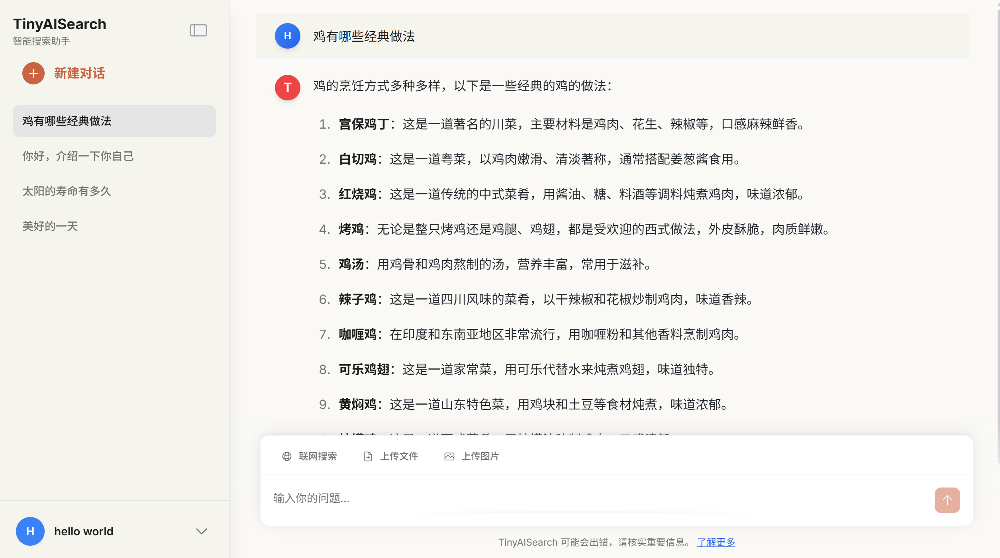

# TinyAISearch

[ [中文](README.md) | English ]



---

**TinyAISearch** is a lightweight AI search project that implements the complete RAG process, from **search query analysis** and **web page crawling** to **content retrieval** and **streaming responses**.

The project integrates various retrieval strategies (such as similarity, BM25, and multi-path retrieval), allowing for flexible configuration so you can explore the pros and cons of different approaches. It is also compatible with any large model that supports the OpenAI API (e.g., Qwen, DeepSeek, GLM, Ollama).

The frontend is built with **Vue 3**, featuring a clean, modern interface that supports multi-user and multi-session capabilities. We hope you enjoy using it!

## Screenshots

### Main Interface

**1. Login Interface**


**2. Main Application Interface**


### Core Features Demo

**Daily Conversation Feature**


**Internet Search Feature**


**Answer Source Tracing**


## Features

- **Smart Search Planning**: Analyzes user queries to dynamically generate a search plan.
- **Multiple Retrieval Strategies**: Includes both **V1 (Traditional RAG)** and **V2 (Page-Level Retrieval)** modes, with support for similarity, BM25, and RRF multi-path retrieval and reranking.
- **Highly Extensible**: Supports any **LLM** compatible with the OpenAI API.
- **Modern Frontend**: Built with **Vue 3 + Vite**, featuring an elegant UI with multi-user and multi-session support.
- **Out-of-the-Box**: Comes with a detailed deployment guide to get you up and running in minutes.

## Deployment Guide

### System Requirements

Depending on your chosen deployment method, please ensure your environment meets the following requirements:

#### Docker Deployment (Recommended)
- **Docker**: 20.10.0 or higher
- **Docker Compose**: v2.0 or higher

#### Source Code Deployment
- **Node.js**: v18.0 or higher
- **Python**: v3.10
- **Conda**: For managing Python virtual environments

### Download Project

First, clone the project repository to your local machine:

```bash
git clone https://github.com/David-Lolly/TinyAISearch.git
cd TinyAISearch
```

### Method 1: Docker Deployment (Recommended)

Docker deployment is the simplest and fastest way, requiring no manual environment configuration.

#### 1. Start Services

```bash
# Execute in the project root directory
docker-compose up -d
```

#### 2. Verify Deployment

```bash
# Check container running status
docker-compose ps
```

#### 3. Access Application

After container build completion, access in your browser:
- **Frontend Interface**: http://localhost:8080

#### 4. Stop Services

```bash
# Stop and remove containers
docker-compose down
```

### Method 2: Source Code Deployment

Source code deployment is suitable for users who need secondary development or deep customization.

#### 1. Backend Environment Setup

```bash
# Create and activate Conda virtual environment
conda create -n TinyAISearch python=3.10
conda activate TinyAISearch

# Install Python dependencies (domestic mirror recommended for faster downloads)
pip install -r requirements.txt -i https://pypi.tuna.tsinghua.edu.cn/simple
```

#### 2. Frontend Environment Setup

```bash
# Enter frontend directory
cd frontend

# Configure npm registry (optional, for faster dependency downloads)
npm config set registry https://registry.npmmirror.com

# Install frontend dependencies
npm install
```

#### 3. Start Services

You need to start both frontend and backend services simultaneously. It's recommended to open two terminal windows:

**Terminal 1: Start Backend Service**
```bash
# In project root directory TinyAISearch/
conda activate TinyAISearch
python AISearchServer.py
```
> Seeing `Uvicorn running on http://localhost:5000` indicates successful backend startup

**Terminal 2: Start Frontend Service**
```bash
# In frontend/ directory
npm run dev
```
> Frontend service typically runs on `http://localhost:5173`, please check terminal output for actual address

#### 4. Access Application

After both frontend and backend start successfully, access the frontend address in your browser to begin using.

### Initial Configuration

Regardless of deployment method, initial use requires completing the following configuration steps:

#### 1. User Registration

After accessing the application, you first need to register an account. Username and password can be set arbitrarily, and the system will automatically create a local account.

#### 2. Model Configuration

After successful login, you'll automatically be redirected to the configuration page where you need to fill in the following necessary information:

**Retrieval Mode Selection**:
- **V2 (Recommended)**: Innovative page-level retrieval mode, better suited for internet search scenarios
- **V1**: Traditional RAG mode based on text chunk retrieval

**V1 Retrieval Quality** (only needed when V1 mode is selected):
- `high`: Similarity search + Rerank reordering
- `higher`: Multi-path retrieval (Similarity + BM25) + RRF fusion

**Model Configuration**:
- **LLM Model**: Fill in API Key and Base URL
- **Embedding Model**: Fill in API Key and Base URL
- **Rerank Model** (not required for V2 mode): Fill in API Key and Base URL

**Recommended Service Providers**:
- [SiliconFlow](https://cloud.siliconflow.cn/account/ak): Provides free model service quotas
- Other OpenAI API compatible service providers

**Search Engine Configuration**:
- **Primary Search**: Uses DuckDuckGo by default (no configuration needed)
- **Backup Search** (optional): Google Programmable Search API (100 free calls per day)

#### 3. Connection Testing

After configuration, click the "Connection Test" button on the right side of each configuration item. Ensure all required items pass connection testing before saving configuration and starting to use.

#### 4. Start Using

After successful configuration save, you can begin your AI search experience!

### Frequently Asked Questions

**Q: What to do if container startup fails during Docker deployment?**
A: Please check port usage to ensure ports 8080 and 5000 are not occupied by other programs. Use `docker-compose logs` to view detailed error information.

**Q: What to do if dependency installation fails during source code deployment?**
A: It's recommended to use domestic mirror sources. If network issues occur, try using VPN or changing mirror sources.

**Q: What to do if connection testing fails after configuration?**
A: Please check if API Key is correct, if Base URL is accessible, and if network connection is normal.
B: If Google connection fails, check if API Key and CSE are filled correctly, and verify if proxy is enabled.

## Technical Implementation

### API Documentation:
Please check the corresponding API documentation in the doc directory to understand the specific functions and parameter passing of each backend module.

<details>
<summary><strong>V1 Retrieval Mode (Click to Expand)</strong></summary>

-   **High Quality**: Embeds the user query, performs a similarity search in the vector database, and reranks the retrieved text chunks.
-   **Higher Quality**:
    1.  **Multi-Path Query Generation**: The LLM generates multiple derivative questions from the user's original query.
    2.  **Multi-Path Retrieval**: Performs both **similarity search** and **BM25 sparse retrieval** for all generated questions.
    3.  **RRF Fusion**: Uses the **Reciprocal Rank Fusion** algorithm to merge the results from all paths, improving precision.
    <br>
    
</details>

<details>
<summary><strong>V2 Retrieval Mode (Click to Expand)</strong></summary>

The V2 mode simulates human search behavior by retrieving entire web pages, aiming to provide the LLM with more complete and coherent context.

**Example Workflow**:
1.  **User Input**: `weather in Wuhan today`
2.  **Search Planning**: The LLM analyzes the query and generates a search plan with one or more sub-queries.

    ```json
    {
      "query_analysis": {
        "original_query": "What is the weather in Wuhan today?",
        "key_entities": ["Wuhan weather today"]
      },
      "search_plan": {
        "foundational_queries": [
          {"query": "Wuhan weather forecast today", "engine": "baidu"}
        ]
      }
    }
    ```
3.  **Web Crawling**: Executes the search plan using the specified search engines and crawls the content of the resulting web pages.
4.  **Page-Level Retrieval**:
    -   **Vector Similarity**: Calculates the vector similarity between the query and the full content of each web page.
    -   **BM25 Similarity**: Calculates the BM25 score between the query and the full content of each web page.
    -   **Weighted Ranking**: The two scores are combined to produce a final ranking.
5.  **Content Generation**: The full content of the top-ranked web pages is passed as context to the LLM to generate the final answer.

**Design Philosophy**:
When humans search, they rarely read every single result. We typically find a solution by browsing just two or three relevant pages. Before diving deep, we skim the pages to assess their relevance and quality, spending time only on high-quality content. The traditional RAG approach (V1) often retrieves scattered and repetitive knowledge snippets from different pages, which can hinder the model's ability to form a systematic understanding. In contrast, retrieving entire web pages (V2) provides more detailed and coherent context, helping the model better understand the user's core problem.
</details>


## File Structure

```text
TinyAISearch/
├─ AISearchServer.py             # FastAPI backend main entry point
├─ requirements.txt              # Python dependency list
│
├─ frontend/                     # Frontend subproject (Vue 3 + Vite)
│  ├─ package.json               # Frontend dependencies and npm scripts
│  └─ src/                       # Frontend application source code
│     ├─ components/             # Reusable UI components
│     ├─ services/               # API service layer
│     └─ views/                  # Page components for routing
│
├─ images/                       # README screenshots
├─ logs/                         # Runtime log directory
│
└─ utils/                        # Backend core utility modules
   ├─ config_manager.py          # Configuration management module
   ├─ crawl_web.py               # Web crawler
   ├─ database.py                # Database interaction
   ├─ keywords_extract.py        # Keyword and search plan extraction
   ├─ pages_retrieve.py          # V2 Page-level retrieval
   ├─ response.py                # LLM response generation
   ├─ retrieval.py               # V1 Traditional RAG retrieval
   └─ search_web.py              # Search engine wrapper
```

## TODO List
- File uploading and parsing
- Support for image uploads
- Optimize the memory mechanism
- Add visualization for the model's thinking process (Currently, when using an inference model, the thinking process is not displayed, only the final answer. It is normal for the model to take some time to respond).

## Community & Contributions

We warmly welcome contributions from the community! If you have any suggestions or run into any issues, please feel free to:

-   Submit an **[Issue](https://github.com/David-Lolly/TinyAISearch/issues)**
-   Create a **[Pull Request](https://github.com/David-Lolly/TinyAISearch/pulls)**


