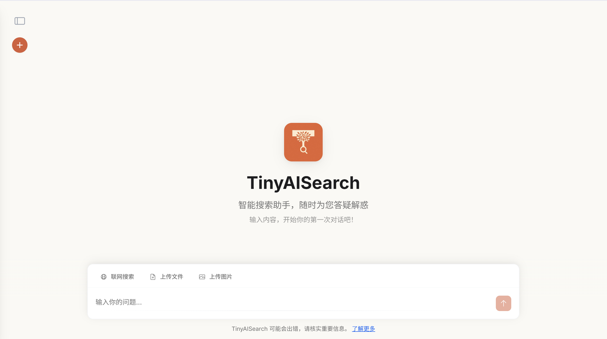
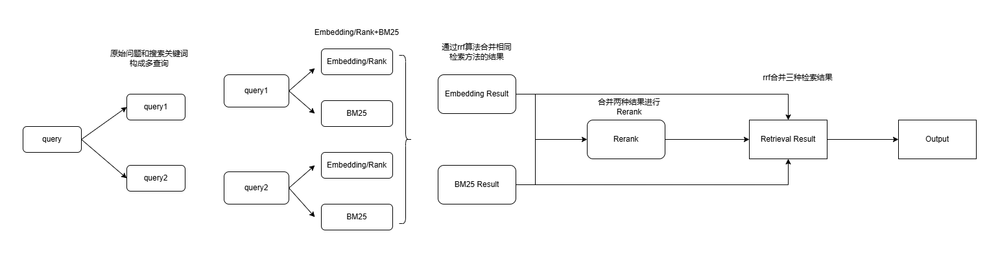

# 🔍 TinyAISearch ✨

[ [中文](README.md) | English ]

---

**TinyAISearch** is a lightweight AI search project that implements the complete RAG process, from **search query analysis** and **web page crawling** to **content retrieval** and **streaming responses**.

The project integrates various retrieval strategies (such as similarity, BM25, and multi-path retrieval), allowing for flexible configuration so you can explore the pros and cons of different approaches. It is also compatible with any large model that supports the OpenAI API (e.g., Qwen, DeepSeek, GLM, Ollama).

The frontend is built with **Vue 3**, featuring a clean, modern interface that supports multi-user and multi-session capabilities. We hope you enjoy using it! 😘

## 🖼️ Screenshots

| Chat Interface | New Chat | Answer Source-Tracing |
| :---: | :---: | :---: |
|  |  |  |

## ✨ Features

- **🧠 Smart Search Planning**: Analyzes user queries to dynamically generate a search plan.
- **🔧 Multiple Retrieval Strategies**: Includes both **V1 (Traditional RAG)** and **V2 (Page-Level Retrieval)** modes, with support for similarity, BM25, and RRF multi-path retrieval and reranking.
- **🔌 Highly Extensible**: Supports any **LLM** compatible with the OpenAI API.
- **💻 Modern Frontend**: Built with **Vue 3 + Vite**, featuring an elegant UI with multi-user and multi-session support.
- **🚀 Out-of-the-Box**: Comes with a detailed deployment guide to get you up and running in minutes.

## 📖 Getting Started

### 1. Prerequisites

Before you begin, ensure you have the following software installed on your local machine:

- **Node.js**: `v18.0` or higher.
- **Python**: `v3.10`.
- **Conda**: For managing the Python virtual environment.

### 2. Download and Install

#### ① Clone the Repository

```sh
git clone https://github.com/David-Lolly/TinyAISearch.git
cd TinyAISearch
```

#### ② Set Up the Backend

```sh
# Create and activate the Conda virtual environment
conda create -n TinyAISearch python=3.10
conda activate TinyAISearch

# Install dependencies (using a mirror is recommended for faster downloads)
pip install -r requirements.txt -i https://pypi.tuna.tsinghua.edu.cn/simple

# It is recommended to install Faiss via Conda to avoid compatibility issues
# If you have a GPU, you can install the GPU version: conda install -c pytorch faiss-gpu
conda install -c pytorch faiss-cpu
```

#### ③ Set Up the Frontend

```sh
# Navigate to the frontend directory
cd frontend

# Install npm dependencies (using a mirror is recommended for faster downloads), this may take a while, so feel free to take a break
npm config set registry https://registry.npmmirror.com
npm install
```

### 3. Launch the Project

You will need to open **two** terminal windows to run the backend and frontend services separately.

- **Terminal 1: Start the Backend Service** (from the root directory `TinyAISearch/`)

```sh
conda activate TinyAISearch
python AISearchServer.py
```
> When you see `Uvicorn running on http://localhost:5000`, the backend has started successfully.

- **Terminal 2: Start the Frontend Service** (from the `TinyAISearch/frontend/` directory)

```sh
npm run dev
```
> The frontend will typically run on `http://localhost:5173`. Check your terminal for the exact address.

### 4. Quick Start

1.  **Register and Log In**: With both services running, open the frontend URL in your browser. You will need to register a new account on your first visit; you can use any username and password.

    

2.  **Configure Models**: After logging in, you will be directed to the **Configuration Page** to enter the necessary API Keys and Base URLs. To modify the configuration later, click on your profile information in the sidebar and select "Modify Configuration".

    

    **Configuration Notes**:
    -   **Retrieval Mode**:
        -   **V2 (Recommended)**: An innovative page-level retrieval mode, better suited for live web searches.
        -   **V1**: A traditional RAG mode based on retrieving text chunks.
    -   **V1 Retrieval Quality**:
        -   `high`: Similarity search + Rerank.
        -   `higher`: Multi-path retrieval (Similarity + BM25) + RRF fusion.
    -   **Model Configuration**:
        -   Fill in the `API_KEY` and `BASE_URL` for your **LLM**, **Embedding**, and **Rerank** models.
        -   **The Rerank model is not required for V2 mode**.
        -   You can get free model services from platforms like [SiliconFlow](https://cloud.siliconflow.cn/account/ak).
    -   **Auxiliary Search Engine**:
        -   It is recommended to configure the Google Search API as a backup in case DuckDuckGo is temporarily blocked. Google Programmable Search Engine provides 100 free calls per day.
    -   **Save Configuration**:
        -   The **connection test for all required fields must pass** before you can save the configuration and start chatting.

3.  **Start Chatting**: Once everything is configured, you're ready to start your AI search journey! 🎉

## 🔧 Technical Implementation

<details>
<summary><strong>V1 Retrieval Mode (Click to Expand)</strong></summary>

-   **High Quality**: Embeds the user query, performs a similarity search in the vector database, and reranks the retrieved text chunks.
-   **Higher Quality**:
    1.  **Multi-Path Query Generation**: The LLM generates multiple derivative questions from the user's original query.
    2.  **Multi-Path Retrieval**: Performs both **similarity search** and **BM25 sparse retrieval** for all generated questions.
    3.  **RRF Fusion**: Uses the **Reciprocal Rank Fusion** algorithm to merge the results from all paths, improving precision.
    <br>
    
</details>

<details>
<summary><strong>V2 Retrieval Mode (Click to Expand)</strong></summary>

The V2 mode simulates human search behavior by retrieving entire web pages, aiming to provide the LLM with more complete and coherent context.

**Example Workflow**:
1.  **User Input**: `weather in Wuhan today`
2.  **Search Planning**: The LLM analyzes the query and generates a search plan with one or more sub-queries.

    ```json
    {
      "query_analysis": {
        "original_query": "What is the weather in Wuhan today?",
        "key_entities": ["Wuhan weather today"]
      },
      "search_plan": {
        "foundational_queries": [
          {"query": "Wuhan weather forecast today", "engine": "baidu"}
        ]
      }
    }
    ```
3.  **Web Crawling**: Executes the search plan using the specified search engines and crawls the content of the resulting web pages.
4.  **Page-Level Retrieval**:
    -   **Vector Similarity**: Calculates the vector similarity between the query and the full content of each web page.
    -   **BM25 Similarity**: Calculates the BM25 score between the query and the full content of each web page.
    -   **Weighted Ranking**: The two scores are combined to produce a final ranking.
5.  **Content Generation**: The full content of the top-ranked web pages is passed as context to the LLM to generate the final answer.

**Design Philosophy**:
When humans search, they rarely read every single result. We typically find a solution by browsing just two or three relevant pages. Before diving deep, we skim the pages to assess their relevance and quality, spending time only on high-quality content. The traditional RAG approach (V1) often retrieves scattered and repetitive knowledge snippets from different pages, which can hinder the model's ability to form a systematic understanding. In contrast, retrieving entire web pages (V2) provides more detailed and coherent context, helping the model better understand the user's core problem.
</details>


## 📂 File Structure

```text
TinyAISearch/
├─ AISearchServer.py             # FastAPI backend main entry point
├─ requirements.txt              # Python dependency list
│
├─ frontend/                     # Frontend subproject (Vue 3 + Vite)
│  ├─ package.json               # Frontend dependencies and npm scripts
│  └─ src/                       # Frontend application source code
│     ├─ components/             # Reusable UI components
│     ├─ services/               # API service layer
│     └─ views/                  # Page components for routing
│
├─ images/                       # README screenshots
├─ logs/                         # Runtime log directory
│
└─ utils/                        # Backend core utility modules
   ├─ config_manager.py          # Configuration management module
   ├─ crawl_web.py               # Web crawler
   ├─ database.py                # Database interaction
   ├─ keywords_extract.py        # Keyword and search plan extraction
   ├─ pages_retrieve.py          # V2 Page-level retrieval
   ├─ response.py                # LLM response generation
   ├─ retrieval.py               # V1 Traditional RAG retrieval
   └─ search_web.py              # Search engine wrapper
```

## TODO List
- File uploading and parsing
- Support for image uploads
- Optimize the memory mechanism
- Add visualization for the model's thinking process (Currently, when using an inference model, the thinking process is not displayed, only the final answer. It is normal for the model to take some time to respond).

## 🤝 Community & Contributions

We warmly welcome contributions from the community! If you have any suggestions or run into any issues, please feel free to:

-   Submit an **[Issue](https://github.com/David-Lolly/TinyAISearch/issues)**
-   Create a **[Pull Request](https://github.com/David-Lolly/TinyAISearch/pulls)**

---
